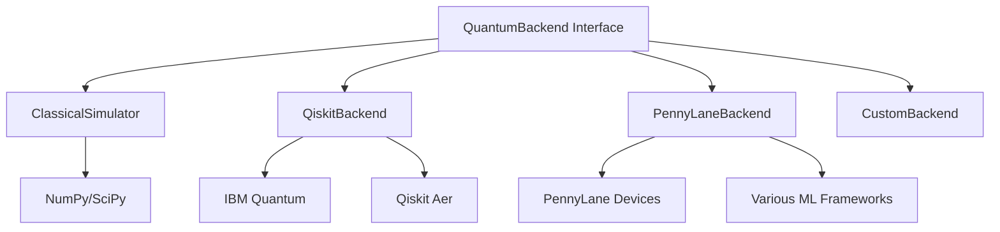

# Quantum Backends

This document describes the quantum backend architecture that enables the Probabilistic Quantum Reasoner to run on different quantum computing platforms.

## Backend Architecture

The backend system provides a unified interface for quantum operations across different quantum computing frameworks:



## Backend Interface

All backends implement the `QuantumBackend` abstract base class:

```python
from abc import ABC, abstractmethod
from typing import Dict, List, Any, Optional
import numpy as np

class QuantumBackend(ABC):
    """Abstract base class for quantum backends."""
    
    @abstractmethod
    def create_quantum_state(self, amplitudes: np.ndarray) -> Any:
        """Create a quantum state from amplitudes."""
        pass
    
    @abstractmethod
    def apply_unitary(self, state: Any, unitary: np.ndarray) -> Any:
        """Apply unitary operator to quantum state."""
        pass
    
    @abstractmethod
    def measure_state(self, state: Any, measurement_basis: Optional[np.ndarray] = None) -> Dict[str, Any]:
        """Measure quantum state."""
        pass
    
    @abstractmethod
    def compute_expectation(self, state: Any, observable: np.ndarray) -> float:
        """Compute expectation value of observable."""
        pass
    
    @abstractmethod
    def tensor_product(self, states: List[Any]) -> Any:
        """Compute tensor product of quantum states."""
        pass
    
    @abstractmethod
    def partial_trace(self, state: Any, subsystem: int, dimensions: List[int]) -> Any:
        """Compute partial trace over subsystem."""
        pass
```

## Available Backends

### Classical Simulator

Perfect for development, testing, and educational purposes:

```python
from probabilistic_quantum_reasoner.backends import ClassicalSimulator

class ClassicalSimulator(QuantumBackend):
    """Classical simulation of quantum systems."""
    
    def __init__(self, seed: Optional[int] = None):
        """Initialize classical simulator.
        
        Args:
            seed: Random seed for reproducible results
        """
        self.rng = np.random.RandomState(seed)
    
    def create_quantum_state(self, amplitudes: np.ndarray) -> np.ndarray:
        """Create quantum state as complex amplitude vector."""
        normalized = amplitudes / np.linalg.norm(amplitudes)
        return normalized.astype(complex)
    
    def apply_unitary(self, state: np.ndarray, unitary: np.ndarray) -> np.ndarray:
        """Apply unitary matrix multiplication."""
        return unitary @ state
    
    def measure_state(self, state: np.ndarray, 
                     measurement_basis: Optional[np.ndarray] = None) -> Dict[str, Any]:
        """Simulate quantum measurement via Born rule."""
        probabilities = np.abs(state) ** 2
        outcome = self.rng.choice(len(state), p=probabilities)
        
        # Create post-measurement state
        post_state = np.zeros_like(state)
        post_state[outcome] = 1.0
        
        return {
            "outcome": outcome,
            "probability": probabilities[outcome],
            "post_measurement_state": post_state
        }
```

**Features:**

- Perfect quantum simulation (no noise)
- Efficient for small systems (<20 qubits)
- Deterministic with optional random seeding
- Full quantum state access for debugging

**Use Cases:**

- Algorithm development and testing
- Educational demonstrations
- Classical limit verification
- Performance benchmarking

### Qiskit Backend

Interface to IBM Quantum systems and simulators:

```python
from probabilistic_quantum_reasoner.backends import QiskitBackend

class QiskitBackend(QuantumBackend):
    """Qiskit-based quantum backend."""
    
    def __init__(self, device_name: str = "aer_simulator", 
                 shots: int = 1024, optimization_level: int = 1):
        """Initialize Qiskit backend.
        
        Args:
            device_name: Qiskit device/simulator name
            shots: Number of measurement shots
            optimization_level: Circuit optimization level
        """
        try:
            from qiskit import Aer, IBMQ
            from qiskit.circuit import QuantumCircuit
            from qiskit.quantum_info import Statevector
        except ImportError:
            raise ImportError("Qiskit required for QiskitBackend")
        
        self.device_name = device_name
        self.shots = shots
        self.optimization_level = optimization_level
        self.backend = Aer.get_backend(device_name)
    
    def create_quantum_state(self, amplitudes: np.ndarray) -> 'Statevector':
        """Create Qiskit Statevector."""
        from qiskit.quantum_info import Statevector
        return Statevector(amplitudes)
    
    def apply_unitary(self, state: 'Statevector', unitary: np.ndarray) -> 'Statevector':
        """Apply unitary using Qiskit."""
        return state.evolve(unitary)
    
    def measure_state(self, state: 'Statevector', 
                     measurement_basis: Optional[np.ndarray] = None) -> Dict[str, Any]:
        """Perform quantum measurement via circuit execution."""
        from qiskit import QuantumCircuit, execute
        
        # Create measurement circuit
        n_qubits = int(np.log2(len(state.data)))
        qc = QuantumCircuit(n_qubits, n_qubits)
        
        # Initialize state
        qc.initialize(state.data, range(n_qubits))
        
        # Add measurements
        qc.measure_all()
        
        # Execute circuit
        job = execute(qc, self.backend, shots=self.shots)
        result = job.result()
        counts = result.get_counts()
        
        # Process results
        total_shots = sum(counts.values())
        outcome_probs = {int(outcome, 2): count/total_shots 
                        for outcome, count in counts.items()}
        
        # Sample outcome based on measurement statistics
        outcomes = list(outcome_probs.keys())
        probabilities = list(outcome_probs.values())
        sampled_outcome = np.random.choice(outcomes, p=probabilities)
        
        return {
            "outcome": sampled_outcome,
            "probability": outcome_probs[sampled_outcome],
            "measurement_counts": counts,
            "shots": self.shots
        }
```

**Features:**

- Access to IBM Quantum hardware
- Realistic noise models
- Circuit optimization
- Quantum error correction

**Use Cases:**

- Real quantum hardware experiments
- Noise-aware algorithm testing
- Quantum advantage demonstrations
- Research applications

### PennyLane Backend

Optimized for variational quantum algorithms and machine learning:

```python
from probabilistic_quantum_reasoner.backends import PennyLaneBackend

class PennyLaneBackend(QuantumBackend):
    """PennyLane-based quantum backend."""
    
    def __init__(self, device_name: str = "default.qubit", 
                 shots: Optional[int] = None, **device_kwargs):
        """Initialize PennyLane backend.
        
        Args:
            device_name: PennyLane device name
            shots: Number of shots (None for analytic)
            **device_kwargs: Additional device arguments
        """
        try:
            import pennylane as qml
        except ImportError:
            raise ImportError("PennyLane required for PennyLaneBackend")
        
        self.device_name = device_name
        self.shots = shots
        self.device_kwargs = device_kwargs
        
    def create_quantum_device(self, n_qubits: int):
        """Create PennyLane quantum device."""
        import pennylane as qml
        return qml.device(self.device_name, wires=n_qubits, 
                         shots=self.shots, **self.device_kwargs)
    
    def create_variational_circuit(self, n_qubits: int, parameters: np.ndarray):
        """Create parameterized quantum circuit."""
        import pennylane as qml
        
        dev = self.create_quantum_device(n_qubits)
        
        @qml.qnode(dev)
        def circuit(params):
            # Ansatz: alternating rotation and entanglement layers
            for i in range(n_qubits):
                qml.RY(params[i], wires=i)
            
            for i in range(n_qubits - 1):
                qml.CNOT(wires=[i, i + 1])
            
            # Additional parameterized layers
            layer_size = len(params) // 2
            for i in range(min(layer_size, n_qubits)):
                qml.RZ(params[n_qubits + i], wires=i)
            
            return [qml.probs(wires=i) for i in range(n_qubits)]
        
        return circuit
    
    def optimize_variational_circuit(self, circuit, target_distribution: np.ndarray, 
                                   max_iterations: int = 100):
        """Optimize circuit parameters to match target distribution."""
        import pennylane as qml
        
        # Initialize parameters
        n_params = circuit.func.__code__.co_argcount - 1  # Exclude self
        params = np.random.uniform(0, 2*np.pi, n_params)
        
        # Optimizer
        optimizer = qml.GradientDescentOptimizer(stepsize=0.1)
        
        def cost_function(params):
            probs = circuit(params)
            # Flatten probability distributions
            flat_probs = np.concatenate([p for p in probs])
            flat_target = target_distribution.flatten()
            
            # KL divergence loss
            return np.sum(flat_target * np.log(flat_target / (flat_probs + 1e-10)))
        
        # Optimization loop
        for iteration in range(max_iterations):
            params = optimizer.step(cost_function, params)
            
            if iteration % 20 == 0:
                loss = cost_function(params)
                print(f"Iteration {iteration}: Loss = {loss:.6f}")
        
        return params
```

**Features:**

- Automatic differentiation
- Variational algorithm support
- Multiple backend targets
- Machine learning integration

**Use Cases:**

- Variational quantum eigensolvers (VQE)
- Quantum approximate optimization (QAOA)
- Quantum machine learning
- Hybrid classical-quantum optimization

## Backend Selection Guidelines

### Development Phase

Use `ClassicalSimulator` for:

- Algorithm prototyping
- Unit testing
- Educational examples
- Performance benchmarking

### Research Phase

Use `QiskitBackend` for:

- Hardware validation
- Noise characterization
- Quantum advantage studies
- Publication-quality results

### Machine Learning

Use `PennyLaneBackend` for:

- Variational algorithms
- Parameter optimization
- Hybrid models
- Gradient-based learning

## Configuration Examples

### Local Development

```python
# Classical simulation for development
from probabilistic_quantum_reasoner.backends import ClassicalSimulator

backend = ClassicalSimulator(seed=42)  # Reproducible results
network = QuantumBayesianNetwork("DevNetwork", backend)
```

### IBM Quantum

```python
# Real quantum hardware
from probabilistic_quantum_reasoner.backends import QiskitBackend

backend = QiskitBackend(
    device_name="ibmq_qasm_simulator",  # or real device like "ibmq_lima"
    shots=8192,
    optimization_level=3
)
network = QuantumBayesianNetwork("ProductionNetwork", backend)
```

### Variational Optimization

```python
# PennyLane for variational algorithms
from probabilistic_quantum_reasoner.backends import PennyLaneBackend

backend = PennyLaneBackend(
    device_name="default.qubit",
    shots=None  # Analytic gradients
)
network = QuantumBayesianNetwork("VariationalNetwork", backend)
```

## Performance Comparison

| Backend | Qubits | Speed | Noise | Gradients | Hardware |
|---------|--------|-------|-------|-----------|----------|
| Classical | ~20 | Fast | None | Finite-diff | CPU |
| Qiskit | Variable | Medium | Realistic | Finite-diff | IBM Quantum |
| PennyLane | ~20 | Medium | Optional | Automatic | Multiple |

## Custom Backends

You can implement custom backends for specialized hardware:

```python
class CustomBackend(QuantumBackend):
    """Custom quantum backend implementation."""
    
    def __init__(self, custom_device):
        self.device = custom_device
    
    def create_quantum_state(self, amplitudes: np.ndarray):
        # Custom state creation logic
        return self.device.create_state(amplitudes)
    
    # Implement other required methods...
```

## Next Steps

- Learn about [Inference Engines](inference.md)
- Explore [User Guide](../guide/networks.md) for practical usage
- See [Performance Optimization](../advanced/optimization.md)
- Check [API Reference](../api/backends.md) for detailed documentation
