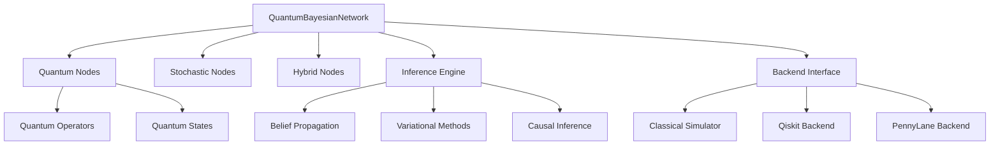

# Core Components

This document describes the core components of the Probabilistic Quantum Reasoner architecture.

## Overview

The library is built around several key components that work together to enable quantum-classical hybrid reasoning:



## Core Classes

### QuantumBayesianNetwork

The main orchestrator class that manages the entire network:

```python
from probabilistic_quantum_reasoner import QuantumBayesianNetwork

class QuantumBayesianNetwork:
    """Main quantum Bayesian network class."""
    
    def __init__(self, name: str, backend: QuantumBackend)
    def add_quantum_node(self, node_id: str, **kwargs) -> QuantumNode
    def add_stochastic_node(self, node_id: str, **kwargs) -> StochasticNode  
    def add_hybrid_node(self, node_id: str, **kwargs) -> HybridNode
    def add_edge(self, parent: Node, child: Node) -> None
    def entangle(self, nodes: List[QuantumNode]) -> None
    def infer(self, **kwargs) -> InferenceResult
    def intervene(self, **kwargs) -> InferenceResult
    def measure_node(self, node_id: str) -> MeasurementResult
```

**Key Features:**

- Graph structure management
- Node lifecycle management  
- Edge relationship tracking
- Quantum entanglement coordination
- Inference orchestration

### Node Types

#### QuantumNode

Represents quantum probabilistic variables:

```python
class QuantumNode:
    """Quantum node with superposition states."""
    
    def __init__(self, node_id: str, outcome_space: List[Any], 
                 initial_amplitudes: np.ndarray)
    
    @property
    def quantum_state(self) -> QuantumState
    @property 
    def probability_distribution(self) -> Dict[Any, float]
    
    def apply_operator(self, operator: UnitaryOperator) -> None
    def measure(self, measurement: MeasurementOperator) -> MeasurementResult
    def set_amplitudes(self, amplitudes: np.ndarray) -> None
```

**Properties:**

- Complex amplitude vectors
- Quantum superposition support
- Unitary evolution capability
- Measurement collapse behavior

#### StochasticNode

Classical probabilistic nodes:

```python
class StochasticNode:
    """Classical stochastic node."""
    
    def __init__(self, node_id: str, outcome_space: List[Any])
    
    @property
    def prior_distribution(self) -> np.ndarray
    @property
    def conditional_probability_table(self) -> ConditionalProbabilityTable
    
    def set_evidence(self, value: Any) -> None
    def sample(self) -> Any
```

**Properties:**

- Probability distributions
- Conditional probability tables
- Classical sampling
- Evidence integration

#### HybridNode

Quantum-classical hybrid nodes:

```python
class HybridNode:
    """Hybrid quantum-classical node."""
    
    def __init__(self, node_id: str, outcome_space: List[Any],
                 mixing_parameter: float)
    
    @property
    def quantum_component(self) -> QuantumNode
    @property
    def classical_component(self) -> StochasticNode
    @property
    def mixing_parameter(self) -> float
    
    def get_hybrid_distribution(self) -> Dict[Any, float]
```

**Properties:**

- Weighted quantum-classical mixing
- Coherent superposition with decoherence
- Flexible reasoning paradigms
- Smooth classical limit

### Quantum State Management

#### QuantumState

Core quantum state representation:

```python
class QuantumState:
    """Quantum state with amplitudes and phase."""
    
    def __init__(self, amplitudes: np.ndarray)
    
    @property
    def amplitudes(self) -> np.ndarray
    @property 
    def probabilities(self) -> np.ndarray
    @property
    def dimension(self) -> int
    
    def normalize(self) -> None
    def tensor_product(self, other: 'QuantumState') -> 'QuantumState'
    def partial_trace(self, subsystem: int) -> 'QuantumState'
    def fidelity(self, other: 'QuantumState') -> float
```

**Features:**

- Amplitude normalization
- Tensor product composition
- Partial trace for subsystems
- State fidelity computation

### Quantum Operators

#### UnitaryOperator

Quantum unitary transformations:

```python
class UnitaryOperator:
    """Unitary quantum operator."""
    
    def __init__(self, matrix: np.ndarray)
    
    @property
    def matrix(self) -> np.ndarray
    @property
    def dimension(self) -> int
    
    def apply(self, state: np.ndarray) -> np.ndarray
    def dagger(self) -> 'UnitaryOperator'
    def compose(self, other: 'UnitaryOperator') -> 'UnitaryOperator'
```

#### MeasurementOperator

Quantum measurement processes:

```python
class MeasurementOperator:
    """Quantum measurement operator."""
    
    def __init__(self, measurement_basis: List[np.ndarray])
    
    def measure(self, state: np.ndarray) -> MeasurementResult
    def expectation_value(self, state: np.ndarray) -> float
    def variance(self, state: np.ndarray) -> float
```

### Conditional Probability Tables

Classical conditional dependencies:

```python
class ConditionalProbabilityTable:
    """Conditional probability table for classical nodes."""
    
    def __init__(self, child_outcomes: List[Any], 
                 parent_outcomes: List[List[Any]])
    
    def set_probability(self, child_value: Any, parent_values: Tuple,
                       probability: float) -> None
    def get_probability(self, child_value: Any, 
                       parent_values: Tuple) -> float
    def get_distribution(self, parent_values: Tuple) -> Dict[Any, float]
    def normalize(self) -> None
```

## Data Flow

### Inference Pipeline

1. **State Preparation**: Initialize quantum and classical nodes
2. **Message Passing**: Propagate information through network
3. **Quantum Evolution**: Apply unitary operators and entanglement
4. **Measurement**: Collapse quantum states when needed
5. **Result Compilation**: Aggregate marginal and joint distributions

### Memory Management

- **Quantum States**: Exponential scaling in qubit number
- **Classical Tables**: Polynomial scaling in variable count  
- **Hybrid Mixing**: Linear combination overhead
- **Entanglement**: Tensor product state spaces

## Error Handling

```python
# Custom exception hierarchy
class QuantumReasoningError(Exception): pass
class QuantumStateError(QuantumReasoningError): pass
class InferenceError(QuantumReasoningError): pass
class BackendError(QuantumReasoningError): pass
class MeasurementError(QuantumReasoningError): pass
```

## Performance Considerations

### Scalability Limits

- **Classical simulation**: ~20 qubits practical limit
- **Quantum hardware**: Noise and decoherence constraints
- **Memory usage**: 2^n complex numbers for n qubits
- **Computational complexity**: Exponential in general case

### Optimization Strategies

- **Sparse representations**: For mostly classical networks
- **Approximate methods**: Variational and sampling approaches
- **Backend selection**: Match algorithm to hardware capabilities
- **Caching**: Reuse computed quantum states and measurements

## Next Steps

- Learn about [Quantum Backends](backends.md)
- Explore [Inference Engines](inference.md) 
- See [User Guide](../guide/networks.md) for practical usage
- Check [API Reference](../api/core.md) for detailed documentation
