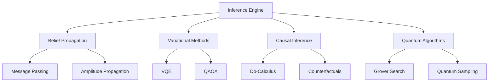

# Inference Engines

This document describes the inference algorithms and engines that power probabilistic reasoning in quantum-classical hybrid networks.

## Overview

The inference system combines classical probabilistic reasoning with quantum amplitude-based computation to provide powerful uncertainty modeling capabilities:



## Inference Engine Architecture

The main inference coordinator manages different reasoning algorithms:

```python
from probabilistic_quantum_reasoner.inference import InferenceEngine

class InferenceEngine:
    """Main inference engine for quantum Bayesian networks."""
    
    def __init__(self, network: QuantumBayesianNetwork):
        self.network = network
        self.belief_propagation = QuantumBeliefPropagation(network)
        self.variational_engine = VariationalInference(network)
        self.causal_engine = CausalInference(network)
    
    def infer(self, query_nodes: List[str], evidence: Dict[str, Any] = None,
              method: str = "belief_propagation", **kwargs) -> InferenceResult:
        """Perform probabilistic inference."""
        
        if method == "belief_propagation":
            return self.belief_propagation.infer(query_nodes, evidence, **kwargs)
        elif method == "variational":
            return self.variational_engine.infer(query_nodes, evidence, **kwargs)
        elif method == "sampling":
            return self._quantum_sampling(query_nodes, evidence, **kwargs)
        else:
            raise ValueError(f"Unknown inference method: {method}")
```

## Belief Propagation

Quantum belief propagation extends classical message passing to quantum amplitude domains.

### Quantum Message Passing

```python
class QuantumBeliefPropagation:
    """Quantum belief propagation algorithm."""
    
    def propagate_messages(self, max_iterations: int = 50) -> bool:
        """Propagate quantum amplitude messages through network."""
        
        for iteration in range(max_iterations):
            converged = True
            
            for edge in self.network.edges:
                # Compute quantum message from parent to child
                old_message = self.messages.get(edge, None)
                new_message = self._compute_quantum_message(edge)
                
                # Check convergence
                if old_message is not None:
                    fidelity = self._compute_message_fidelity(old_message, new_message)
                    if fidelity < 0.999:  # Convergence threshold
                        converged = False
                
                self.messages[edge] = new_message
            
            if converged:
                return True
        
        return False  # Did not converge
    
    def _compute_quantum_message(self, edge: Tuple[str, str]) -> QuantumMessage:
        """Compute quantum amplitude message along edge."""
        parent_id, child_id = edge
        parent_node = self.network.nodes[parent_id]
        child_node = self.network.nodes[child_id]
        
        if isinstance(parent_node, QuantumNode):
            # Quantum parent sends amplitude message
            parent_amplitudes = parent_node.quantum_state.amplitudes
            
            # Apply conditional probability transformation
            if hasattr(child_node, 'conditional_probability_table'):
                cpt = child_node.conditional_probability_table
                message_amplitudes = self._apply_cpt_to_amplitudes(
                    parent_amplitudes, cpt
                )
            else:
                # Direct amplitude propagation
                message_amplitudes = parent_amplitudes
            
            return QuantumMessage(
                amplitudes=message_amplitudes,
                sender=parent_id,
                receiver=child_id
            )
        
        else:
            # Classical parent sends probability message (converted to amplitudes)
            parent_probs = parent_node.probability_distribution
            message_amplitudes = np.sqrt(list(parent_probs.values())).astype(complex)
            
            return QuantumMessage(
                amplitudes=message_amplitudes,
                sender=parent_id,
                receiver=child_id
            )
```

### Amplitude Integration

```python
def _integrate_messages(self, node_id: str) -> QuantumState:
    """Integrate incoming quantum messages at a node."""
    node = self.network.nodes[node_id]
    incoming_messages = [msg for msg in self.messages.values() 
                        if msg.receiver == node_id]
    
    if isinstance(node, QuantumNode):
        # Start with node's intrinsic quantum state
        combined_amplitudes = node.quantum_state.amplitudes.copy()
        
        # Multiply by incoming amplitude messages
        for message in incoming_messages:
            combined_amplitudes = self._multiply_amplitudes(
                combined_amplitudes, message.amplitudes
            )
        
        # Normalize
        combined_amplitudes /= np.linalg.norm(combined_amplitudes)
        
        return QuantumState(combined_amplitudes)
    
    else:
        # Classical node: convert messages to probabilities
        combined_probs = np.ones(len(node.outcome_space))
        
        for message in incoming_messages:
            message_probs = np.abs(message.amplitudes) ** 2
            combined_probs *= message_probs
        
        # Normalize and convert back to amplitudes
        combined_probs /= np.sum(combined_probs)
        combined_amplitudes = np.sqrt(combined_probs).astype(complex)
        
        return QuantumState(combined_amplitudes)
```

## Variational Inference

Variational methods optimize parameterized quantum circuits to approximate posterior distributions.

### Variational Quantum Eigensolver (VQE)

```python
class VariationalInference:
    """Variational quantum inference using VQE."""
    
    def __init__(self, network: QuantumBayesianNetwork, backend: QuantumBackend):
        self.network = network
        self.backend = backend
    
    def optimize_variational_distribution(self, target_nodes: List[str], 
                                        evidence: Dict[str, Any] = None,
                                        max_iterations: int = 100) -> Dict[str, Any]:
        """Optimize variational quantum circuit to approximate posterior."""
        
        # Create parameterized quantum circuit
        n_qubits = len(target_nodes)
        n_parameters = 2 * n_qubits  # RY and RZ rotations per qubit
        
        def create_ansatz(parameters: np.ndarray):
            """Create variational ansatz circuit."""
            circuit_ops = []
            
            # Layer 1: Individual rotations
            for i, param in enumerate(parameters[:n_qubits]):
                circuit_ops.append(('RY', i, param))
            
            # Layer 2: Entangling gates
            for i in range(n_qubits - 1):
                circuit_ops.append(('CNOT', i, i + 1))
            
            # Layer 3: More rotations
            for i, param in enumerate(parameters[n_qubits:2*n_qubits]):
                circuit_ops.append(('RZ', i, param))
            
            return circuit_ops
        
        # Cost function: KL divergence from target distribution
        def cost_function(parameters: np.ndarray) -> float:
            circuit = create_ansatz(parameters)
            variational_state = self._execute_circuit(circuit)
            
            # Compute target distribution from network inference
            target_result = self.network.infer(
                query_nodes=target_nodes, 
                evidence=evidence,
                method="belief_propagation"
            )
            
            # Extract target probabilities
            target_probs = []
            for node_id in target_nodes:
                node_dist = target_result.marginal_probabilities[node_id]
                target_probs.extend(list(node_dist.values()))
            
            target_probs = np.array(target_probs)
            variational_probs = np.abs(variational_state.amplitudes) ** 2
            
            # KL divergence
            epsilon = 1e-10
            kl_div = np.sum(target_probs * np.log(
                (target_probs + epsilon) / (variational_probs + epsilon)
            ))
            
            return kl_div
        
        # Optimization using classical optimizer
        from scipy.optimize import minimize
        
        initial_params = np.random.uniform(0, 2*np.pi, n_parameters)
        result = minimize(
            cost_function, 
            initial_params, 
            method='L-BFGS-B',
            options={'maxiter': max_iterations}
        )
        
        # Return optimized parameters and final state
        optimal_circuit = create_ansatz(result.x)
        optimal_state = self._execute_circuit(optimal_circuit)
        
        return {
            "optimal_parameters": result.x,
            "optimal_state": optimal_state,
            "final_cost": result.fun,
            "optimization_success": result.success,
            "iterations": result.nit
        }
```

### Quantum Approximate Optimization Algorithm (QAOA)

```python
def qaoa_inference(self, query_nodes: List[str], evidence: Dict[str, Any] = None,
                  p_layers: int = 3) -> Dict[str, Any]:
    """Use QAOA for approximate inference."""
    
    # Define problem Hamiltonian based on network structure
    problem_hamiltonian = self._construct_problem_hamiltonian(query_nodes, evidence)
    
    # Define mixer Hamiltonian (usually sum of X rotations)
    mixer_hamiltonian = self._construct_mixer_hamiltonian(len(query_nodes))
    
    # QAOA ansatz with p layers
    def qaoa_circuit(gamma_params: np.ndarray, beta_params: np.ndarray):
        """QAOA circuit with alternating problem and mixer unitaries."""
        
        # Initialize in uniform superposition
        state = np.ones(2**len(query_nodes), dtype=complex) / np.sqrt(2**len(query_nodes))
        
        for p in range(p_layers):
            # Apply problem unitary: exp(-i * gamma * H_problem)
            problem_unitary = self._matrix_exponential(-1j * gamma_params[p] * problem_hamiltonian)
            state = problem_unitary @ state
            
            # Apply mixer unitary: exp(-i * beta * H_mixer)
            mixer_unitary = self._matrix_exponential(-1j * beta_params[p] * mixer_hamiltonian)
            state = mixer_unitary @ state
        
        return state
    
    # Optimize QAOA parameters
    def qaoa_cost(params):
        gamma_params = params[:p_layers]
        beta_params = params[p_layers:]
        
        final_state = qaoa_circuit(gamma_params, beta_params)
        expectation = np.real(np.conj(final_state) @ problem_hamiltonian @ final_state)
        
        return expectation
    
    # Classical optimization
    initial_params = np.random.uniform(0, np.pi, 2 * p_layers)
    result = minimize(qaoa_cost, initial_params, method='COBYLA')
    
    # Extract final quantum state
    optimal_gamma = result.x[:p_layers]
    optimal_beta = result.x[p_layers:]
    final_state = qaoa_circuit(optimal_gamma, optimal_beta)
    
    return {
        "optimal_state": final_state,
        "optimal_parameters": {"gamma": optimal_gamma, "beta": optimal_beta},
        "expectation_value": result.fun,
        "optimization_success": result.success
    }
```

## Causal Inference

Implement do-calculus and counterfactual reasoning in quantum networks.

### Do-Calculus Implementation

```python
class CausalInference:
    """Causal inference with quantum interventions."""
    
    def do_intervention(self, interventions: Dict[str, Any], 
                       query_nodes: List[str]) -> InferenceResult:
        """Perform causal intervention using do-calculus."""
        
        # Create modified network with interventions
        modified_network = self.network.copy()
        
        for node_id, intervention_value in interventions.items():
            node = modified_network.nodes[node_id]
            
            if isinstance(node, QuantumNode):
                # Quantum intervention: set node to specific amplitude pattern
                intervention_amplitudes = self._create_intervention_amplitudes(
                    node.outcome_space, intervention_value
                )
                node.set_amplitudes(intervention_amplitudes)
                
                # Remove incoming edges (break causal dependencies)
                incoming_edges = [edge for edge in modified_network.edges 
                                if edge[1] == node_id]
                for edge in incoming_edges:
                    modified_network.remove_edge(edge)
            
            else:
                # Classical intervention: set deterministic distribution
                intervention_dist = {value: 1.0 if value == intervention_value else 0.0
                                   for value in node.outcome_space}
                node.set_distribution(intervention_dist)
                
                # Remove incoming edges
                incoming_edges = [edge for edge in modified_network.edges 
                                if edge[1] == node_id]
                for edge in incoming_edges:
                    modified_network.remove_edge(edge)
        
        # Perform inference on modified network
        return modified_network.infer(query_nodes=query_nodes)
```

### Counterfactual Reasoning

```python
def counterfactual_inference(self, factual_evidence: Dict[str, Any],
                           counterfactual_intervention: Dict[str, Any],
                           query_nodes: List[str]) -> Dict[str, Any]:
    """Perform counterfactual reasoning: "What if X had been Y instead of Z?"."""
    
    # Step 1: Abduction - infer latent variables given factual evidence
    latent_inference = self.network.infer(
        query_nodes=self._get_latent_nodes(),
        evidence=factual_evidence
    )
    
    # Step 2: Action - apply counterfactual intervention
    counterfactual_network = self.network.copy()
    
    # Set latent variables to inferred values
    for latent_id in self._get_latent_nodes():
        latent_dist = latent_inference.marginal_probabilities[latent_id]
        # Sample from posterior or use expected value
        latent_value = max(latent_dist.items(), key=lambda x: x[1])[0]
        counterfactual_network.set_evidence(latent_id, latent_value)
    
    # Apply intervention
    counterfactual_result = counterfactual_network.intervene(
        interventions=counterfactual_intervention,
        query_nodes=query_nodes
    )
    
    # Step 3: Prediction - compute counterfactual outcome
    return {
        "factual_evidence": factual_evidence,
        "counterfactual_intervention": counterfactual_intervention,
        "latent_posterior": latent_inference.marginal_probabilities,
        "counterfactual_outcome": counterfactual_result.marginal_probabilities,
        "causal_effect": self._compute_causal_effect(
            factual_evidence, counterfactual_result.marginal_probabilities
        )
    }
```

## Quantum-Specific Algorithms

### Grover-Based Search

```python
def grover_inference(self, query_predicate: callable, 
                    max_iterations: Optional[int] = None) -> Dict[str, Any]:
    """Use Grover's algorithm for quantum search-based inference."""
    
    n_qubits = len(self.network.quantum_nodes)
    n_items = 2 ** n_qubits
    
    if max_iterations is None:
        max_iterations = int(np.pi * np.sqrt(n_items) / 4)
    
    # Initialize uniform superposition
    state = np.ones(n_items, dtype=complex) / np.sqrt(n_items)
    
    # Grover iterations
    for iteration in range(max_iterations):
        # Oracle: mark satisfying states
        oracle_matrix = self._construct_oracle_matrix(query_predicate)
        state = oracle_matrix @ state
        
        # Diffusion operator: amplify marked amplitudes
        diffusion_matrix = self._construct_diffusion_matrix(n_items)
        state = diffusion_matrix @ state
    
    # Measure final state
    probabilities = np.abs(state) ** 2
    
    return {
        "amplitudes": state,
        "probabilities": probabilities,
        "most_likely_state": np.argmax(probabilities),
        "iterations": max_iterations
    }
```

## Performance Characteristics

### Complexity Analysis

| Algorithm | Time Complexity | Space Complexity | Quantum Advantage |
|-----------|----------------|------------------|-------------------|
| Belief Propagation | O(n²d^k) | O(nd) | Amplitude interference |
| Variational | O(poly(n)) | O(2^n) | Circuit expressivity |
| QAOA | O(p·poly(n)) | O(2^n) | Quantum parallelism |
| Grover Search | O(√N) | O(log N) | Quadratic speedup |

Where:
- n = number of nodes
- d = domain size
- k = maximum node degree
- p = QAOA layers
- N = search space size

### Accuracy vs Speed Trade-offs

```python
# Configuration for different use cases
INFERENCE_CONFIGS = {
    "fast": {
        "method": "belief_propagation",
        "max_iterations": 10,
        "convergence_threshold": 1e-3
    },
    "accurate": {
        "method": "variational",
        "max_iterations": 1000,
        "convergence_threshold": 1e-6
    },
    "quantum_advantage": {
        "method": "grover",
        "max_iterations": None,  # Optimal
        "post_processing": True
    }
}
```

## Next Steps

- Learn about [building networks](../guide/networks.md) 
- Explore [causal reasoning](../guide/causal.md) in detail
- See [variational methods](../guide/variational.md) examples
- Check [API Reference](../api/inference.md) for complete documentation
