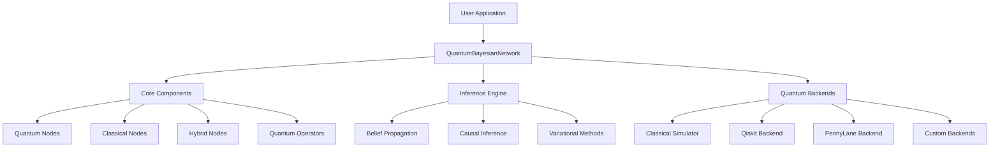
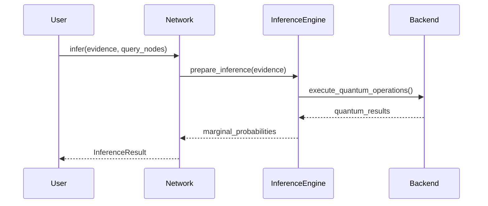

# Architecture Overview

The Probabilistic Quantum Reasoner is designed with a modular, extensible architecture that supports both classical simulation and quantum hardware execution.

## High-Level Architecture



## Core Design Principles

### 1. Quantum-Classical Hybrid Architecture

The library seamlessly integrates quantum and classical computation:

- **Quantum Variables**: Represented as quantum states with complex amplitudes
- **Classical Variables**: Traditional discrete random variables
- **Hybrid Variables**: Mixture of quantum and classical uncertainty

### 2. Backend Abstraction

All quantum operations go through an abstract backend interface:

```python
class QuantumBackend:
    def execute_circuit(self, circuit, measurements):
        """Execute quantum circuit and return measurement results."""
        pass
    
    def get_quantum_state(self, circuit):
        """Return the quantum state vector."""
        pass
    
    def apply_gate(self, gate, qubits):
        """Apply quantum gate to specified qubits."""
        pass
```

This allows the same high-level code to run on:

- Classical simulators (NumPy-based)
- IBM Quantum hardware (via Qiskit)
- Variational quantum processors (via PennyLane)
- Custom quantum devices

### 3. Probabilistic Graphical Model Foundation

Built on established PGM principles:

- **Nodes**: Random variables (quantum, classical, or hybrid)
- **Edges**: Conditional dependencies
- **Inference**: Message passing and belief propagation
- **Causal**: Do-calculus for interventions

## Component Details

### Core Components (`core/`)

#### QuantumBayesianNetwork

The main orchestrator that manages:

- Network topology (nodes and edges)
- Quantum state management
- Inference coordination
- Causal operations

#### Node Types

- **QuantumNode**: Variables in quantum superposition
- **StochasticNode**: Classical discrete random variables  
- **HybridNode**: Mixed quantum-classical variables

#### Quantum Operators

- **UnitaryOperator**: Reversible quantum transformations
- **MeasurementOperator**: Quantum measurements with Born rule
- **QuantumGate**: Library of standard quantum gates

### Inference Engine (`inference/`)

#### Belief Propagation (`belief_propagation.py`)

Quantum-enhanced message passing:

- Amplitude-based messages
- Quantum interference effects
- Entanglement-aware propagation

#### Causal Inference (`causal.py`)

Quantum do-calculus implementation:

- Interventional distributions P(Y|do(X))
- Counterfactual reasoning
- Causal effect identification

#### Variational Methods (`variational.py`)

Quantum optimization algorithms:

- Variational Quantum Eigensolver (VQE)
- Quantum Approximate Optimization Algorithm (QAOA)
- Parameter optimization

### Backend Implementations (`backends/`)

#### Classical Simulator (`simulator.py`)

High-performance NumPy-based simulation:

- Exact quantum state vector simulation
- Efficient tensor operations
- Automatic classical fallbacks

#### Qiskit Backend (`qiskit_backend.py`)

IBM Quantum integration:

- IBMQ hardware access
- Quantum circuit compilation
- Error mitigation techniques

#### PennyLane Backend (`pennylane_backend.py`)

Variational quantum computing:

- Automatic differentiation
- Multiple device support
- Hybrid optimization

## Data Flow

### 1. Network Construction

```python
network = QuantumBayesianNetwork("MyNetwork", backend)
node = network.add_quantum_node("variable", outcome_space, amplitudes)
network.add_edge(parent, child)
```

### 2. Quantum State Management

- Nodes maintain quantum states as complex amplitude vectors
- Edges define conditional dependencies via quantum operators
- Network tracks entanglement relationships

### 3. Inference Process



### 4. Backend Execution

- Abstract quantum operations into backend calls
- Graceful fallback to classical simulation
- Result validation and error handling

## Performance Characteristics

### Time Complexity

- **Classical simulation**: O(2^n) for n quantum variables
- **Quantum hardware**: O(poly(n)) for many algorithms
- **Hybrid algorithms**: Problem-dependent optimization

### Space Complexity

- **Quantum states**: O(2^n) amplitudes stored
- **Classical variables**: O(k^m) for k states, m variables
- **Hybrid representation**: Automatic optimization

### Scalability Limits

- **Classical simulation**: ~20 quantum variables
- **NISQ devices**: ~100 quantum variables (noisy)
- **Future quantum**: Exponential scaling potential

## Extensibility Points

### Custom Node Types

```python
class MyCustomNode(BaseNode):
    def __init__(self, node_id, outcome_space, **kwargs):
        super().__init__(node_id, outcome_space, **kwargs)
        # Custom initialization
    
    def compute_message(self, evidence):
        # Custom message computation
        pass
```

### Custom Inference Algorithms

```python
class MyInferenceAlgorithm(InferenceAlgorithm):
    def infer(self, network, evidence, query_nodes):
        # Custom inference logic
        return InferenceResult(...)
```

### Custom Backends

```python
class MyQuantumBackend(QuantumBackend):
    def execute_circuit(self, circuit, measurements):
        # Interface to your quantum hardware
        pass
```

## Error Handling Strategy

### Quantum-Specific Errors

- **QuantumStateError**: Invalid quantum states
- **EntanglementError**: Entanglement consistency issues
- **MeasurementError**: Measurement operation failures
- **BackendError**: Quantum backend communication errors

### Graceful Degradation

- Automatic fallback to classical simulation
- Approximate algorithms when exact solutions intractable
- Warning systems for quantum coherence loss

### Validation

- Quantum state normalization checks
- Probability distribution validation
- Network topology consistency verification

## Next Steps

- [Core Components](core.md): Detailed component documentation
- [Quantum Backends](backends.md): Backend-specific guides
- [Inference Engines](inference.md): Algorithm details
