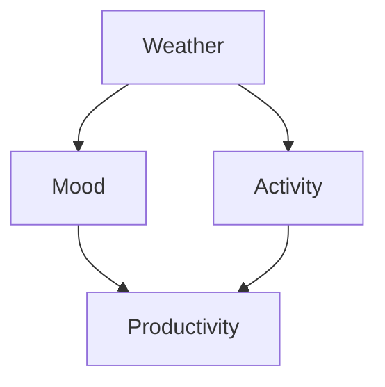

# Documentation Guidelines

This document provides guidelines for contributing to and maintaining the project documentation.

## Documentation Philosophy

Our documentation follows these principles:

- **User-First**: Write for the user's needs and experience level
- **Complete**: Cover all functionality with examples
- **Accurate**: Keep documentation synchronized with code
- **Accessible**: Use clear language and good structure
- **Maintainable**: Make documentation easy to update

## Documentation Structure

### Overview

```text
docs/
├── index.md                   # Main landing page
├── getting-started/           # Getting started guides
│   ├── installation.md
│   ├── quick-start.md
│   └── basic-concepts.md
├── architecture/              # System architecture
│   ├── overview.md
│   ├── quantum-backends.md
│   └── inference-engines.md
├── user-guide/               # Detailed user guides
│   ├── creating-networks.md
│   ├── inference.md
│   ├── causal-reasoning.md
│   └── performance.md
├── examples/                 # Code examples
│   ├── weather-prediction.md
│   ├── medical-diagnosis.md
│   ├── quantum-xor.md
│   └── prisoners-dilemma.md
├── api/                      # API documentation
│   ├── inference.md
│   ├── backends.md
│   └── examples.md
├── advanced/                 # Advanced topics
│   ├── entanglement.md
│   ├── custom-backends.md
│   └── optimization.md
└── contributing/             # Contributing guides
    ├── setup.md
    ├── testing.md
    └── docs.md
```

## Writing Guidelines

### Markdown Standards

#### Headers

Use ATX-style headers with proper hierarchy:

```markdown
# Page Title (H1) - Only one per page

## Major Section (H2)

### Subsection (H3)

#### Sub-subsection (H4)
```

#### Code Blocks

Always specify the language for syntax highlighting:

```markdown
```python
def example_function():
    return "Always specify language"
```

```bash
# For shell commands
pip install probabilistic-quantum-reasoner
```

```yaml
# For configuration files
config:
  backend: qiskit
```
```

#### Links

Use descriptive link text:

```markdown
<!-- Good -->
See the [installation guide](installation.md) for setup instructions.

<!-- Bad -->
Click [here](installation.md) for installation.
```

#### Lists

Use consistent formatting:

```markdown
- First item
- Second item
  - Nested item
  - Another nested item
- Third item

1. Numbered first item
2. Numbered second item
3. Numbered third item
```

### Content Guidelines

#### Code Examples

All code examples should be:

1. **Complete**: Include all necessary imports and setup
2. **Runnable**: Examples should work when copy-pasted
3. **Explained**: Include context and explanation
4. **Tested**: Verify examples work with current codebase

Example structure:

```markdown
## Creating a Simple Network

This example shows how to create a basic Bayesian network:

```python
from probabilistic_quantum_reasoner import ProbabilisticQuantumReasoner
from probabilistic_quantum_reasoner.networks import BayesianNetwork
from probabilistic_quantum_reasoner.nodes import DiscreteNode
import numpy as np

# Create a new network
network = BayesianNetwork(name="Weather Example")

# Add a weather node
weather = DiscreteNode(
    name="Weather",
    states=["sunny", "rainy"],
    prior=[0.7, 0.3]
)

# Add a mood node that depends on weather
mood = DiscreteNode(
    name="Mood",
    states=["happy", "sad"],
    parents=[weather],
    cpt=np.array([
        [0.8, 0.2],  # P(Mood | Weather=sunny)
        [0.3, 0.7]   # P(Mood | Weather=rainy)
    ])
)

# Add nodes to network
network.add_nodes([weather, mood])

# Create reasoner and perform inference
reasoner = ProbabilisticQuantumReasoner(backend="classical")
result = reasoner.infer(
    network=network,
    query=["Mood"],
    evidence={"Weather": "sunny"}
)

print(f"P(Mood=happy | Weather=sunny) = {result['Mood']['happy']:.3f}")
# Output: P(Mood=happy | Weather=sunny) = 0.800
```

**Key points:**

- The `prior` parameter specifies initial probabilities
- The `cpt` (Conditional Probability Table) defines dependencies
- Evidence is provided as a dictionary of {variable: value} pairs
```

#### Mathematical Notation

Use MathJax for mathematical expressions:

```markdown
The probability of state $s_i$ given evidence $e$ is:

$$P(s_i | e) = \frac{P(e | s_i) P(s_i)}{P(e)}$$

For inline math, use single dollar signs: $P(A|B)$.
```

#### Diagrams

Include diagrams for complex concepts:

```markdown
### Network Structure



This network represents causal relationships between weather conditions and daily outcomes.
```

#### API Documentation

Use consistent format for API documentation:

```markdown
### `infer(network, query, evidence=None, method="auto")`

Perform probabilistic inference on a Bayesian network.

**Parameters:**

- `network` (BayesianNetwork): The network to perform inference on
- `query` (list): List of variable names to query
- `evidence` (dict, optional): Evidence as {variable: value} pairs
- `method` (str, optional): Inference method ("exact", "approximate", "auto")

**Returns:**

- `dict`: Probability distributions for queried variables

**Raises:**

- `ValueError`: If query variables don't exist in network
- `InferenceError`: If inference fails to converge

**Example:**

```python
result = reasoner.infer(
    network=my_network,
    query=["Temperature"],
    evidence={"Season": "winter"},
    method="exact"
)
```
```

## Documentation Types

### Getting Started Documentation

**Purpose**: Help new users get up and running quickly

**Characteristics**:
- Step-by-step instructions
- Minimal prerequisites assumed
- Working examples
- Links to more detailed documentation

**Template**:

```markdown
# Getting Started with [Feature]

## Prerequisites

Before you begin, ensure you have:

- Python 3.10 or later installed
- Basic understanding of probability theory

## Installation

Install the package using pip:

```bash
pip install probabilistic-quantum-reasoner
```

## Your First [Feature]

Let's create a simple example:

[Step-by-step example with explanations]

## Next Steps

Now that you've created your first [feature], you might want to:

- Learn about [related concept A](link-a.md)
- Explore [advanced feature B](link-b.md)
- See more [examples](../examples/)
```

### Tutorial Documentation

**Purpose**: Guide users through complete workflows

**Characteristics**:
- Goal-oriented
- Progressive complexity
- Multiple interconnected examples
- Learning checkpoints

### Reference Documentation

**Purpose**: Provide comprehensive API details

**Characteristics**:
- Complete parameter descriptions
- Return value specifications
- Exception documentation
- Links to related functions

### Conceptual Documentation

**Purpose**: Explain underlying concepts and theory

**Characteristics**:
- Background information
- Theoretical foundations
- Design decisions
- Comparison with alternatives

## Documentation Tools

### MkDocs Configuration

Our documentation uses MkDocs with the Material theme:

```yaml
# mkdocs.yml key sections
site_name: Probabilistic Quantum Reasoner
theme:
  name: material
  features:
    - navigation.tabs
    - navigation.sections
    - toc.integrate
    - search.highlight

plugins:
  - search
  - mkdocstrings:
      handlers:
        python:
          options:
            docstring_style: google
  - mermaid2

markdown_extensions:
  - pymdownx.highlight
  - pymdownx.superfences:
      custom_fences:
        - name: mermaid
          class: mermaid
          format: !!python/name:mermaid2.fence_mermaid
  - pymdownx.arithmatex:
      generic: true

extra_javascript:
  - https://polyfill.io/v3/polyfill.min.js?features=es6
  - https://cdn.jsdelivr.net/npm/mathjax@3/es5/tex-mml-chtml.js
```

### Docstring Format

Use Google-style docstrings for API documentation:

```python
def infer(self, network, query, evidence=None, method="auto"):
    """Perform probabilistic inference on a Bayesian network.

    This method computes the posterior probability distribution for the
    query variables given the evidence using the specified inference method.

    Args:
        network (BayesianNetwork): The network to perform inference on.
        query (list[str]): List of variable names to query.
        evidence (dict[str, Any], optional): Evidence as {variable: value} 
            pairs. Defaults to None.
        method (str, optional): Inference method to use. Can be "exact",
            "approximate", or "auto". Defaults to "auto".

    Returns:
        dict[str, dict[str, float]]: Probability distributions for each
            queried variable. Structure is {variable: {state: probability}}.

    Raises:
        ValueError: If query variables don't exist in the network.
        InferenceError: If inference fails to converge.

    Example:
        >>> reasoner = ProbabilisticQuantumReasoner()
        >>> result = reasoner.infer(
        ...     network=my_network,
        ...     query=["Weather"],
        ...     evidence={"Season": "summer"}
        ... )
        >>> print(result["Weather"]["sunny"])
        0.85

    Note:
        When method="auto", the system will automatically choose the most
        appropriate inference algorithm based on network characteristics.
    """
```

## Review Process

### Documentation Reviews

All documentation changes should be reviewed for:

1. **Accuracy**: Information matches current implementation
2. **Clarity**: Content is understandable by target audience
3. **Completeness**: All necessary information is included
4. **Consistency**: Follows established style and conventions
5. **Examples**: Code examples work and are relevant

### Review Checklist

- [ ] Content is accurate and up-to-date
- [ ] Examples are complete and runnable
- [ ] Links work and point to correct locations
- [ ] Spelling and grammar are correct
- [ ] Markdown formatting is proper
- [ ] Code blocks have language specified
- [ ] Mathematical notation renders correctly
- [ ] Images and diagrams are clear and necessary

## Maintenance

### Keeping Documentation Current

1. **Code Changes**: Update docs when changing APIs
2. **Regular Reviews**: Schedule periodic documentation audits
3. **User Feedback**: Monitor and respond to documentation issues
4. **Testing**: Include documentation in CI/CD pipelines

### Documentation Testing

Test documentation as part of the build process:

```python
# tests/test_docs.py
import subprocess
import pytest

def test_docs_build():
    """Test that documentation builds without errors."""
    result = subprocess.run(
        ["mkdocs", "build", "--strict"],
        capture_output=True,
        text=True
    )
    
    assert result.returncode == 0, f"Docs build failed: {result.stderr}"

def test_example_code():
    """Test that code examples in documentation are valid."""
    # Extract and test code blocks from markdown files
    # Implementation depends on documentation structure
    pass

@pytest.mark.slow
def test_links():
    """Test that all documentation links are valid."""
    # Check internal and external links
    # Can use tools like linkchecker
    pass
```

### Style Guide

#### Voice and Tone

- **Active voice**: "Create a network" rather than "A network is created"
- **Present tense**: "The function returns" rather than "The function will return"
- **Second person**: "You can configure" rather than "One can configure"
- **Clear and direct**: Avoid unnecessary jargon

#### Terminology

Maintain consistent terminology throughout:

- **Bayesian Network** (not Bayes Net or BN)
- **Quantum Circuit** (not quantum program)
- **Inference Engine** (not inference algorithm when referring to the component)
- **Backend** (not back-end or back end)

#### Common Phrases

Use consistent phrasing:

- "Perform inference" (not "do inference" or "run inference")
- "Create a network" (not "build a network" or "make a network")
- "Install the package" (not "install the library")
- "Configure the backend" (not "setup the backend")

## Publishing

### Local Development

To work on documentation locally:

```bash
# Install development dependencies
pip install -e ".[docs]"

# Serve documentation locally
mkdocs serve

# Build documentation
mkdocs build

# Deploy to GitHub Pages (maintainers only)
mkdocs gh-deploy
```

### Continuous Integration

Documentation is automatically built and deployed:

- **Pull Requests**: Documentation builds are tested
- **Main Branch**: Documentation is deployed to GitHub Pages
- **Releases**: Documentation is tagged and archived

This documentation system ensures that users have comprehensive, accurate, and maintainable guidance for using the Probabilistic Quantum Reasoner effectively.
